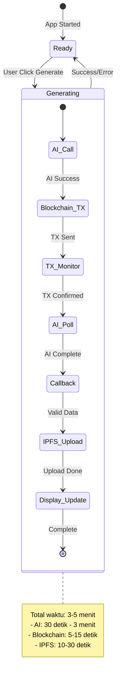
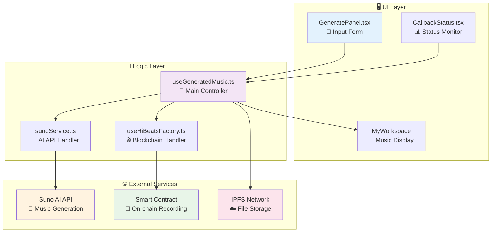
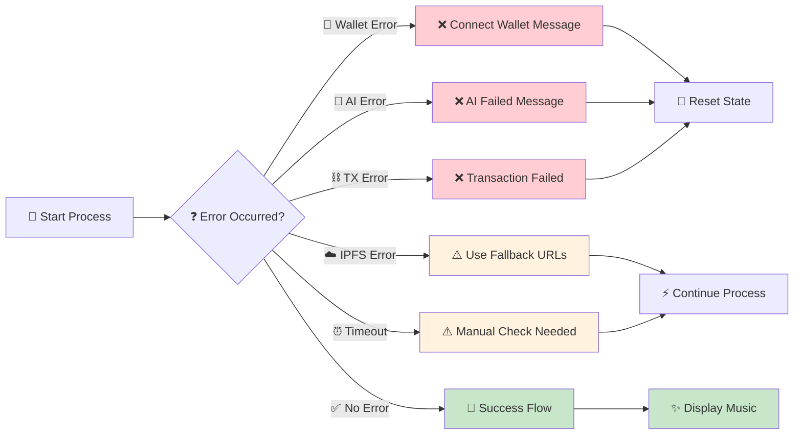
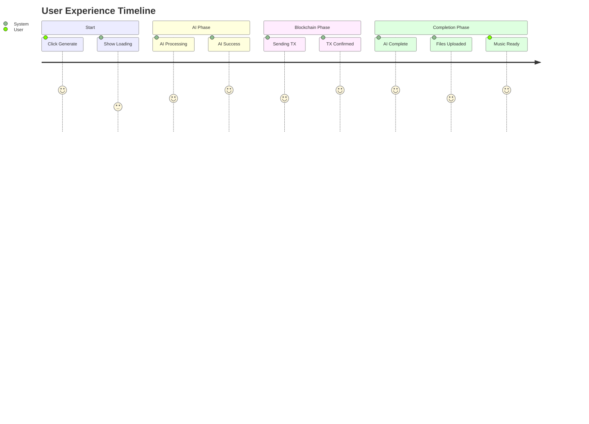

# HiBeats Music Generation Flowchart

## 🎵 Alur Utama: Generate Music Sampai Display

```mermaid
flowchart TD
    START([👤 User Click Generate]) --> VALIDATE{✅ Wallet & Input Valid?}
    
    VALIDATE -->|❌ No| ERROR1[❌ Show Error Message]
    VALIDATE -->|✅ Yes| INIT[🚀 Initialize Generation Process]
    
    %% Step 1: AI Generation
    INIT --> API[📡 1. Call Suno AI API]
    API --> APICHECK{🤖 AI Success?}
    APICHECK -->|❌ No| ERROR2[❌ AI Generation Failed]
    APICHECK -->|✅ Yes| TASKID[✅ Get taskId from AI]
    
    %% Step 2: Blockchain Recording  
    TASKID --> BLOCKCHAIN[⛓️ 2. Send to Smart Contract]
    BLOCKCHAIN --> TXCHECK{🔗 Transaction Success?}
    TXCHECK -->|❌ No| ERROR3[❌ Transaction Failed]
    TXCHECK -->|✅ Yes| TXHASH[✅ Get Transaction Hash]
    
    %% Step 3: Wait for Confirmation
    TXHASH --> MONITOR[🔄 3. Monitor TX Confirmation<br/>Poll every 1 second]
    MONITOR --> CONFIRMED{✅ TX Confirmed?}
    CONFIRMED -->|⏰ Timeout| WARNING[⚠️ TX Timeout Warning]
    CONFIRMED -->|✅ Yes| SUCCESS[🎉 Transaction Success!]
    
    %% Step 4: AI Completion Polling
    SUCCESS --> POLL[🔍 4. Poll AI Completion<br/>Check every 15-45 seconds]
    WARNING --> POLL
    
    POLL --> AIREADY{🎵 AI Music Ready?}
    AIREADY -->|⏰ Timeout| ERROR4[⏰ AI Generation Timeout]
    AIREADY -->|✅ Yes| CALLBACK[📦 Process AI Callback Data]
    
    %% Step 5: Process Results
    CALLBACK --> VALIDATE_CB{📊 Valid Callback?}
    VALIDATE_CB -->|❌ No| ERROR5[❌ Invalid Callback Data]
    VALIDATE_CB -->|✅ Yes| PROCESS[🔄 5. Process Each Track]
    
    %% Step 6: Upload to IPFS
    PROCESS --> IPFS[� 6. Upload to IPFS<br/>Audio → Image → Metadata]
    IPFS --> IPFSCHECK{☁️ IPFS Success?}
    IPFSCHECK -->|⚠️ Partial| FALLBACK[⚠️ Use Fallback URLs]
    IPFSCHECK -->|✅ Yes| METADATA[📋 Create NFT Metadata]
    FALLBACK --> METADATA
    
    %% Step 7: Update Display
    METADATA --> CREATE[🎵 Create GeneratedMusic Objects]
    CREATE --> UPDATE[📱 7. Update UI State<br/>setGeneratedMusic()]
    UPDATE --> CLEANUP[🧹 Clean Duplicates]
    CLEANUP --> FINAL[🎉 Show Success Message<br/>"X tracks created!"]
    
    %% Step 8: Display Ready
    FINAL --> DISPLAY[✨ 8. Music Appears in UI<br/>My Workspace Ready]
    
    %% Error Handlers
    ERROR1 --> RESET[🔄 Reset State]
    ERROR2 --> RESET
    ERROR3 --> RESET
    ERROR4 --> RESET
    ERROR5 --> RESET
    
    %% Alternative Callback Path
    POLL -.-> ALT_CB[📨 Alternative Callback<br/>PostMessage Event]
    ALT_CB -.-> CALLBACK
    
    %% Status Components
    DISPLAY --> PLAYER[🎵 Music Player]
    DISPLAY --> WORKSPACE[📊 My Workspace] 
    DISPLAY --> STATUS[� Callback Status]
    
    %% Styling
    classDef startNode fill:#e3f2fd,stroke:#1976d2,stroke-width:3px
    classDef successNode fill:#e8f5e8,stroke:#388e3c,stroke-width:2px
    classDef errorNode fill:#ffebee,stroke:#d32f2f,stroke-width:2px
    classDef processNode fill:#f3e5f5,stroke:#7b1fa2,stroke-width:2px
    classDef warningNode fill:#fff3e0,stroke:#f57c00,stroke-width:2px
    
    class START startNode
    class DISPLAY,SUCCESS,FINAL successNode
    class ERROR1,ERROR2,ERROR3,ERROR4,ERROR5 errorNode
    class INIT,API,BLOCKCHAIN,PROCESS,IPFS,CREATE processNode
    class WARNING,FALLBACK warningNode
```

## 🚀 Flowchart Sederhana: 8 Langkah Utama

```mermaid
flowchart LR
    A[1️⃣ User Input] --> B[2️⃣ AI Generation]
    B --> C[3️⃣ Blockchain TX]
    C --> D[4️⃣ TX Confirmation]
    D --> E[5️⃣ AI Completion]
    E --> F[6️⃣ IPFS Upload]
    F --> G[7️⃣ Create Objects]
    G --> H[8️⃣ Display Music]
    
    style A fill:#e3f2fd
    style B fill:#fff3e0
    style C fill:#e8f5e8
    style D fill:#f3e5f5
    style E fill:#fff3e0
    style F fill:#fce4ec
    style G fill:#f3e5f5
    style H fill:#e8f5e8
```



## ⚡ Timeline Proses

```mermaid
gantt
    title Music Generation Timeline
    dateFormat X
    axisFormat %s
    
    section User Action
    Click Generate     : 0, 1s
    
    section AI Processing
    Suno API Call      : 1s, 3s
    AI Generation      : 3s, 180s
    
    section Blockchain
    Smart Contract     : 1s, 5s
    TX Confirmation    : 5s, 15s
    Record Callback    : 180s, 185s
    
    section File Processing
    IPFS Audio Upload  : 180s, 190s
    IPFS Image Upload  : 185s, 195s
    IPFS Metadata      : 190s, 200s
    
    section Display
    Update UI State    : 200s, 205s
    Music Available    : 205s, 206s
```

## 🔄 State Flow Ringkas



## 🎯 Komponen Utama & Fungsi



## ⚡ Proses Error Handling



## 📱 Toast Notification Timeline



---

## 📋 Ringkasan Proses

### **8 Langkah Utama:**

1. **🎯 User Input** → Validasi wallet & parameter
2. **🤖 AI Generation** → Call Suno API, dapat taskId  
3. **⛓️ Blockchain TX** → Record ke smart contract
4. **🔄 TX Confirmation** → Monitor real-time setiap 1 detik
5. **🎵 AI Completion** → Poll status setiap 15-45 detik
6. **☁️ IPFS Upload** → Upload audio, image, metadata
7. **📱 Create Objects** → Generate GeneratedMusic objects
8. **✨ Display Ready** → Music muncul di My Workspace

### **⏱️ Estimasi Waktu:**

- **AI Generation**: 30 detik - 3 menit
- **Blockchain TX**: 5-15 detik untuk konfirmasi
- **IPFS Upload**: 10-30 detik per file
- **Total**: 3-5 menit end-to-end

### **🔧 Key Components:**

- **GeneratePanel.tsx** → UI input form
- **useGeneratedMusic.ts** → Main controller logic
- **sunoService.ts** → AI API handler
- **CallbackStatus.tsx** → Real-time status monitor
- **Smart Contract** → On-chain data recording
- **IPFS** → Decentralized file storage

### **💡 Smart Features:**

- ✅ Real-time transaction monitoring
- ✅ Multiple callback mechanisms (polling + PostMessage)
- ✅ Automatic error recovery & fallbacks
- ✅ Duplicate prevention
- ✅ Progressive enhancement (IPFS → fallback URLs)
- ✅ Toast notifications dengan unique IDs
